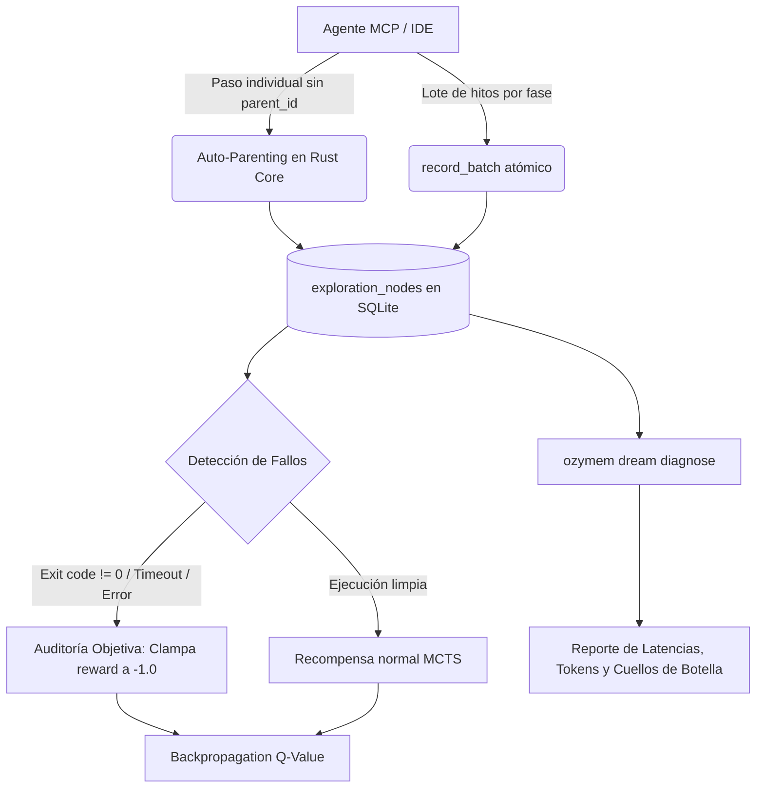

# 🌙 Dream-RSI & Monte Carlo Tree Search (MCTS) v1.1.0

**Dream-RSI** (*Recursive Self-Improvement via Offline MCTS Replay*) es el subsistema de auto-mejora continua de Ozygram. Transforma la resolución de tareas de los agentes de IA de un registro plano y efímero en un **grafo de exploración computable y optimizable**.

---

## 💡 ¿Por Qué Dream-RSI?

Los agentes tradicionales de IA cometen siempre el mismo error: cuando exploran soluciones (ej. intentar una consulta SQL, probar una biblioteca, refactorizar una función), si un intento falla, descartan el contexto o lo dejan perder en un log de texto no estructurado. 

Dream-RSI soluciona esto en dos fases:
1. **Fase Online (En Vivo)**: Mientras el agente resuelve un objetivo, registra sus decisiones en un **Árbol MCTS persistente** en SQLite (`exploration_nodes`), con retropropagación ascendente en tiempo real ($Q \leftarrow Q + \frac{R-Q}{N}$).
2. **Fase Offline ("Sueño")**: En segundo plano (o bajo demanda vía `ozymem dream run`), el simulador contrafactual re-ejecuta el árbol offline **a costo $0 de tokens de LLM**, identifica turnos desperdiciados, calibra la política de exploración UCB1 y promueve automáticamente mejoras sin riesgo de regresión.

---

## ⚡ Novedades de la Versión v1.1.0 (Zero-Friction Engine)

Basado en la experiencia operativa real con agentes en producción, la versión v1.1.0 elimina los tres puntos de fricción del flujo MCTS:



### 1. Auto-Parenting Inteligente en Rust
* **Problema anterior**: El modelo debía recordar y propagar hashes como `node_18d76e...` en cada llamada. Si el contexto se compactaba, la topología se rompía.
* **Solución v1.1.0**: Si se omite `parent_id` en `record_step`, Rust busca automáticamente:
  ```sql
  SELECT id, depth FROM exploration_nodes 
  WHERE trajectory_id = ?1 AND is_pruned = 0
  ORDER BY depth DESC, created_at DESC LIMIT 1;
  ```
  Enlaza el nuevo nodo al último nodo activo y calcula `depth = parent.depth + 1`. Solo se requiere `parent_id` para bifurcaciones explícitas o retrocesos (*backtracking*).

### 2. Modo Lote por Hitos (`record_batch`)
* **Problema anterior**: Para 5 pasos técnicos en una tarea lineal, el agente debía ejecutar 5 llamadas MCP independientes, duplicando el tiempo de respuesta percibido por el usuario (*turn tax*).
* **Solución v1.1.0**: Permite enviar un bloque de hitos en una sola llamada MCP:
  ```json
  {
    "action": "record_batch",
    "trajectory_id": "traj_123",
    "steps": [
      { "action_type": "audit", "observation": "Diagnóstico inicial", "cost_tokens": 120 },
      { "action_type": "refactor", "observation": "Caché de roles añadida", "cost_tokens": 300 },
      { "action_type": "test", "observation": "34 tests pasando al 100%", "reward_score": 1.0, "is_solution": true }
    ]
  }
  ```
  Los nodos se insertan y encadenan secuencialmente dentro de una sola transacción SQLite.

### 3. Auditoría Objetiva de Recompensas (Anti-Alucinación)
* **Problema anterior**: Modelos excesivamente optimistas enviaban `reward_score: 1.0` incluso cuando la compilación o las pruebas fallaban.
* **Solución v1.1.0**: El analizador determinista `detect_failure_signals` audita las observaciones buscando indicadores de fallo (`exit code != 0`, `FAILED`, `SyntaxError`, `TypeError`, `timed out`, etc.). Si se detecta un fallo pero el agente reportó un reward positivo, el motor lo clampea automáticamente a `-1.0` e inyecta la bandera:
  ```json
  {
    "objective_reward_override": true,
    "original_reward": 1.0
  }
  ```

### 4. Diagnóstico Nativo de Cuellos de Botella (`diagnose`)
* Permite auditar cuantitativamente cualquier trayectoria desde MCP o terminal:
  - Nodos de alta latencia (> 3000 ms).
  - Nodos con alto consumo de tokens (> 2000 tokens).
  - Oportunidades de poda (ramas negativas que no fueron podadas).
  - Eficiencia de tokens (% de tokens invertidos en la solución final vs ramas muertas).
  - Sugerencia de constante UCB1 $c$ según la varianza de recompensas.

---

## 🔬 Fórmula Matemática UCB1 / UCT

Cada nodo del árbol de exploración calcula su score UCT para balancear explotación y exploración:

$$\text{UCT}(v_i) = Q(v_i) + c \cdot \sqrt{\frac{\ln N(v)}{N(v_i)}}$$

Donde:
* $Q(v_i)$ es el valor estimado acumulado (running average) de la rama.
* $N(v)$ es el número de visitas del nodo padre.
* $N(v_i)$ es el número de visitas del nodo hijo.
* $c$ es la constante de exploración (por defecto $\sqrt{2} \approx 1.4142$).

---

## 💻 Referencia de Comandos CLI

```bash
# Consultar el estado global de la política activa y métricas MCTS
ozymem dream status

# Salida en formato JSON estructurado
ozymem dream status --json

# Ejecutar el ciclo de simulación offline contrafactual
ozymem dream run

# Diagnosticar cuellos de botella de una trayectoria específica
ozymem dream diagnose traj_5bbd6b4e5c6f

# Diagnóstico en JSON para pipelines de CI/CD
ozymem dream diagnose traj_5bbd6b4e5c6f --json
```

---

## 🔌 Referencia MCP (`ozy_exploration`)

```json
{
  "name": "ozy_exploration",
  "arguments": {
    "action": "start | record_step | record_batch | complete | get_tree | diagnose | list | delete",
    "trajectory_id": "traj_123",
    "task_description": "Objetivo de la tarea",
    "steps": [...],
    "parent_id": "opcional (auto-parenting activo)",
    "reward_score": 1.0,
    "is_solution": true,
    "is_pruned": false
  }
}
```
