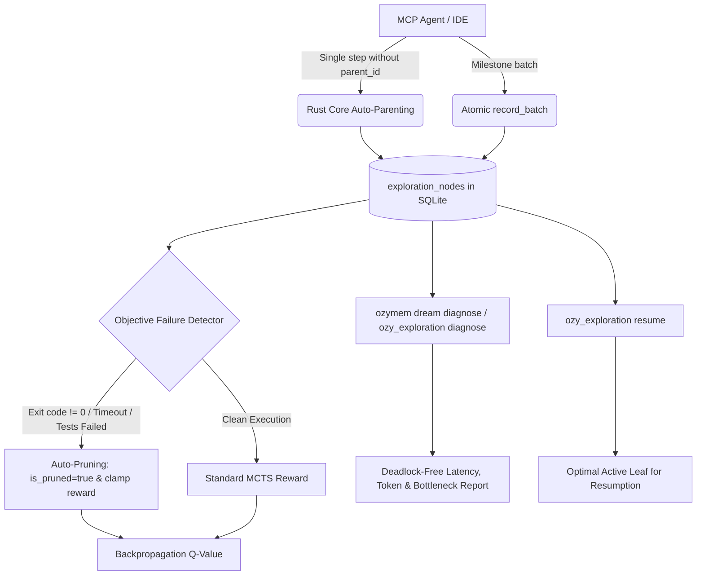

# 🌙 Dream-RSI & Monte Carlo Tree Search (MCTS) v1.1.0
 
**Dream-RSI** (*Recursive Self-Improvement via Offline MCTS Replay*) is Ozygram's continuous self-improvement subsystem. It elevates AI coding agents from flat, ephemeral chat histories into a **computable, structured, and optimizable exploration graph**.
 
---
 
## 💡 Why Dream-RSI?
 
Traditional AI coding agents repeat the same failure modes: when exploring solutions (e.g. testing a SQL query, trying a library, refactoring a function), if an attempt fails, they either discard the entire context or bury it in unstructured chat logs.
 
Dream-RSI solves this through two complementary phases:
1. **Online Phase (Live Execution)**: As the agent works toward a goal, it persists every decision in a **hierarchical MCTS Tree** backed by SQLite (`exploration_nodes`), with real-time upward backpropagation ($Q \leftarrow Q + \frac{R-Q}{N}$).
2. **Offline Phase ("Dreaming")**: In the background (or on-demand via `ozymem dream run`), a counterfactual replay simulator re-traverses the exploration tree **at $0 LLM token cost**, diagnoses wasted turns, tunes the UCB1 exploration policy, and promotes verified lessons without regression risks.
 
---
 
## ⚡ What's New in v1.1.0 (Zero-Friction Engine)
 
Based on operational observations in production workflows, version v1.1.0 addresses core friction points in the agentic MCTS lifecycle:
 

 
### 1. Smart Rust Core Auto-Parenting
* **Previous Pain Point**: Models had to track and propagate complex parent hashes like `node_18d76e...` across turns. If context was compacted, tree topology broke.
* **v1.1.0 Solution**: When `parent_id` is omitted in `record_step`, Rust Core automatically queries:
  ```sql
  SELECT id, depth FROM exploration_nodes 
  WHERE trajectory_id = ?1 AND is_pruned = 0
  ORDER BY depth DESC, created_at DESC LIMIT 1;
  ```
  It links the step to the latest active unpruned node and sets `depth = parent.depth + 1`. An explicit `parent_id` is only required when branching or backtracking.
 
### 2. Milestone Batch Mode (`record_batch`)
* **Previous Pain Point**: For 5 linear technical actions, the agent made 5 separate roundtrip MCP calls, multiplying latency and token overhead (*turn tax*).
* **v1.1.0 Solution**: Submit milestone chains atomically in a single MCP call:
  ```json
  {
    "action": "record_batch",
    "trajectory_id": "traj_123",
    "steps": [
      { "action_type": "audit", "observation": "Initial diagnostic complete", "cost_tokens": 120 },
      { "action_type": "refactor", "observation": "Role cache implemented", "cost_tokens": 300 },
      { "action_type": "test", "observation": "34 tests passing 100%", "reward_score": 1.0, "is_solution": true }
    ]
  }
  ```
  Nodes are chained sequentially within a single SQLite transaction.
 
### 3. Objective Failure Auditing & Self-Pruning
* **Previous Pain Point**: Overly optimistic models assigned `reward_score: 1.0` even when builds broke or tests failed.
* **v1.1.0 Solution**: The deterministic `detect_failure_signals` parser checks observations for failure indicators (`exit code != 0`, `FAILED`, `SyntaxError`, `TypeError`, `timed out`, `failures: `).
  - Automatically overrides inflated rewards to `< 0.0` with `objective_reward_override: true`.
  - Automatically flags `is_pruned: true` with `auto_pruned: true` in the action payload, pruning dead-end branches immediately without waiting for model introspection.
 
### 4. Deadlock-Free Native Trajectory Diagnostics (`diagnose`)
* Quantitative bottleneck audit via MCP or CLI with guaranteed cycle prevention:
  - High-latency nodes (>3000 ms).
  - High token cost nodes (>2000 tokens).
  - Pruning opportunities (negative reward nodes left unpruned).
  - Solution token efficiency percentage (tokens on winning path vs total trajectory tokens).
  - Dynamic UCB1 exploration constant $c$ calibration based on reward variance.
  - Automatic fallback to the most recent trajectory if `trajectory_id` is omitted.
 
### 5. Automatic Trajectory Resumption (`resume`)
* Recovers interrupted trajectories after context compactions or chat resets:
  - Queries the highest value active leaf node (`ORDER BY value_estimate DESC, depth DESC, created_at DESC`).
  - Returns `recommended_resume_node_id` so the agent can resume exploration from the most promising frontier.
 
---
 
## 🔬 Mathematical UCB1 / UCT Formulation
 
Each exploration node balances exploration and exploitation using the Upper Confidence Bound for Trees:
 
$$\text{UCT}(v_i) = Q(v_i) + c \cdot \sqrt{\frac{\ln N(v)}{N(v_i)}}$$
 
Where:
* $Q(v_i)$ is the running average value estimate of the branch.
* $N(v)$ is the parent node's visit count.
* $N(v_i)$ is the child node's visit count.
* $c$ is the exploration constant (default $\sqrt{2} \approx 1.4142$, dynamically calibrated).
 
---
 
## 💻 CLI Command Reference
 
```bash
# Query active policy status and global MCTS metrics
ozymem dream status

# Structured JSON output
ozymem dream status --json

# Run offline counterfactual simulation
ozymem dream run

# Diagnose bottlenecks in a specific trajectory
ozymem dream diagnose traj_5bbd6b4e5c6f

# Structured JSON diagnostic output for CI/CD pipelines
ozymem dream diagnose traj_5bbd6b4e5c6f --json
```
 
---
 
## 🔌 MCP Tool Reference (`ozy_exploration`)
 
```json
{
  "name": "ozy_exploration",
  "arguments": {
    "action": "start | record_step | record_batch | complete | get_tree | diagnose | list | delete | resume",
    "trajectory_id": "traj_123",
    "task_description": "Task objective",
    "steps": [...],
    "parent_id": "optional (auto-parenting enabled)",
    "reward_score": 1.0,
    "is_solution": true,
    "is_pruned": false
  }
}
```
