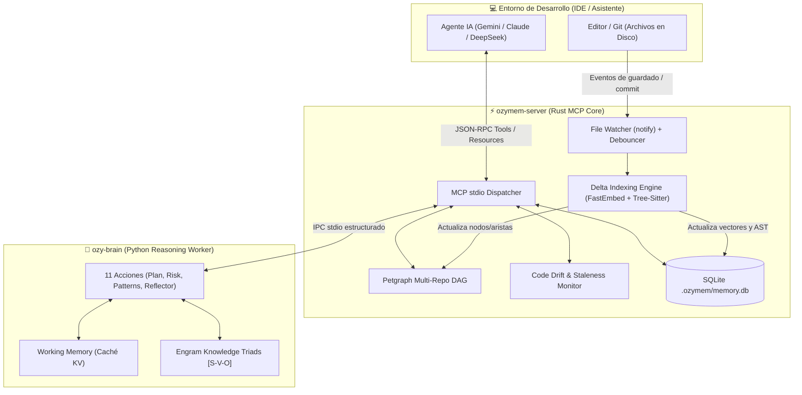
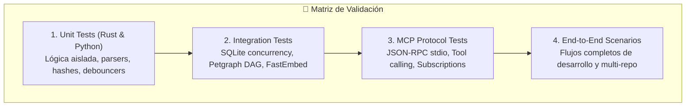

# Plan Técnico de Arquitectura, Tecnologías y Suite de Pruebas para Ozygram / Ozymem

Este documento detalla la arquitectura técnica, las tecnologías seleccionadas para evitar problemas de compatibilidad y dependencias (especialmente en entornos Windows, Rust y Python), el diseño modular de las nuevas capacidades y el plan exhaustivo de pruebas unitarias, de integración y E2E.

---

## 1. Stack Tecnológico Seleccionado (Cero Fricción y Máxima Estabilidad)

Para garantizar un funcionamiento sin dependencias pesadas externas (sin Docker, sin bases de datos remotas y sin fallos de compilación de binarios C++ en Windows), se utiliza un stack 100% nativo y autocontenido:

| Componente | Tecnología / Crate | Versión | Justificación Técnica y Cero Problemas |
| :--- | :--- | :--- | :--- |
| **Core & Concurrencia** | **Rust + Tokio** | `2021` / `1.x` | Rendimiento nativo, consumo mínimo de RAM y manejo asíncrono no bloqueante del protocolo stdio. |
| **Persistencia Transaccional** | **`rusqlite`** (feature: `bundled`) | `0.31` | SQLite compilado estáticamente con el binario de Rust. Cero dependencias de drivers del sistema operativo. Soporte para FTS5 y transacciones ACID. |
| **Indexación Semántica Local** | **`fastembed`** | `4.9.1` | Motor de embeddings ONNX Runtime embebido (modelo *All-MiniLM-L6-v2*). Genera vectores localmente en CPU/GPU sin llamadas a APIs externas ni latencia de red. |
| **Análisis de Código (AST)** | **`tree-sitter` nativo** | `0.26` (Rust, Py, JS, TS, Go) | Parsing estructural ultra-rápido en memoria, insensible a errores sintácticos parciales en caliente. |
| **Grafo en Memoria** | **`petgraph`** | `0.6` | Representación de dependencias de archivos, componentes y tablas en un DAG (Grafo Dirigido Acíclico) de alta velocidad. |
| **File Watcher en Caliente** | **`notify` / `notify-debouncer-mini`** | `6.1` | Listener de eventos del kernel (ReadDirectoryChangesW en Windows, inotify en Linux, FSEvents en macOS) con debouncing para evitar sobrecarga al escribir archivos. |
| **Portabilidad (.ozymem)** | **`flate2` + `tar`** | `1.0` / `0.4` | Empaquetado y compresión nativa de bases de datos de conocimiento sin herramientas externas tipo zip.exe. |
| **Motor de Razonamiento** | **Python 3.10+ (Standard Lib + Schemas)** | `>=3.10` | `ozy-brain` utiliza `dataclasses`, `typing`, `json`, `sqlite3` y `re`. Cero frameworks pesados tipo PyTorch o LangChain que causan conflictos de entornos virtuales. |
| **Protocolo de Comunicación** | **MCP (Model Context Protocol)** | `JSON-RPC 2.0` | Comunicación estándar vía stdio con `serde_json`, soporte de Tool Calling, Resources, Prompts y Resource Subscriptions. |

---

## 2. Arquitectura de Componentes y Flujo de Datos

---

## 3. Especificación Detallada de las Nuevas Características

### A. Delta Indexing en Caliente (Live Sync)
* **Objetivo:** Actualizar el grafo de dependencias y los embeddings vectoriales instantáneamente cuando se guarda un archivo o se ejecuta un commit.
* **Mecanismo y Optimizaciones Preventivas:**
  1. **Prevención del Cold Start (FastEmbed Singleton):**
     * La instancia del modelo `TextEmbedding` se inicializa **una sola vez** al arrancar `ozymem-server` y se comparte a través de `Arc<TextEmbedding>` (o `tokio::sync::OnceCell<Arc<TextEmbedding>>`).
     * No se reinstancia el modelo ONNX en cada evento del watcher, logrando tiempos de inferencia de solo 5-15 ms por delta.
  2. **Filtros Estrictos y Límites de Tamaño (`is_noise_or_huge_file`):**
     * **Límite de tamaño:** Archivos con tamaño superior a **256 KB** (o configurable hasta 512 KB) se excluyen de la vectorización en caliente para no sobrecargar el CPU ni degradar la ventana de tokens.
     * **Archivos minificados / empaquetados:** Ignora automáticamente patrones como `*.min.js`, `*.min.css`, `*.bundle.js`, `*.map`.
     * **Archivos de Lock masivos:** Ignora `package-lock.json`, `pnpm-lock.yaml`, `yarn.lock`, `Cargo.lock`, `poetry.lock`.
     * **Archivos de datos y logs:** Ignora `*.log`, `*.sqlite`, `*.db`, `*.csv`, `*.parquet`, `*.dump`.
  3. `notify-debouncer-mini` agrupa eventos de modificación durante una ventana de 300 ms.
  4. Calcula el hash SHA-256 del contenido: si el hash coincide con el almacenado en SQLite, se descarta (evita re-indexar saves redundantes).
  5. Ejecuta `ozymem-parser` sobre el archivo modificado para actualizar símbolos y dependencias en `petgraph`.
  6. Genera nuevos embeddings para los bloques modificados y actualiza la tabla vectorial atómicamente.

### B. Memoria en Dos Capas (Working Memory + Engram Store)
* **Capa 1 (Working Memory):** Mantiene una memoria de trabajo volátil con los últimos 10-15 intercambios de la tarea actual en formato clave-valor indexable.
* **Capa 2 (Engram Store):** Almacén estructurado de conocimiento a largo plazo. 
  * Convierte lecciones y decisiones en tríadas de conocimiento: `[Entidad/Módulo] -> [Relación/Regla] -> [Efecto/Solución]`.
  * **Triggers de Consolidación:** Se activa automáticamente tras eventos clave (hitos):
    1. Ejecución de commit exitoso en Git.
    2. Pase exitoso de suite de pruebas (`cargo test`, `pytest`, `npm test`).
    3. Cierre y resolución de un bug.

### C. Detección Proactiva de Conflictos (Code vs. Memory Drift) & Auto-Pruning
* **Algoritmo de Vigencia (`staleness_score`):**
  * Cada memoria cuenta con `confidence_score` (0.0 a 1.0), `last_verified_at` y `touch_count`.
  * Si un módulo referenciado en una lección es eliminado o refactorizado profundamente en el AST, el `confidence_score` se degrada.
* **Detector de Drift:**
  * Al analizar un diff o nuevo commit, `ozymem-server` verifica si los cambios violan contratos o convenciones registradas (`record_convention`).
  * Si detecta contradicción, no borra la lección a ciegas: emite una alerta o prompt interactivo (`"El cambio en X contradice la regla Y. ¿Deseas actualizar la regla o revertir el cambio?"`).

### D. Búsqueda Cruzada Multi-Repositorio (Cross-Repo Graph)
* **Ampliación de `ProjectRegistry`:**
  * Permite vincular proyectos en una malla (ej. `api-backend`, `web-frontend`, `mobile-app`).
  * Las tools `analyze_impact` y `ozymem_hybrid_search` admiten el parámetro `scope: "multi-repo"` o `repositories: ["all"]`.
  * Mapea cómo un cambio en un DTO o ruta de backend impacta en los clientes React/Vue/Flutter.

### E. Mapeador Sintético de Endpoints y Contratos de API
* **Extractor AST (`ozymem_map_api_routes`):**
  * Parser nativo para frameworks populares:
    * **Python:** FastAPI / Flask / Django REST (`@app.get`, `@router.post`, Pydantic DTOs).
    * **Node / TS:** Express, NestJS, Fastify, Next.js API Routes.
    * **Rust:** Axum, Actix-web.
  * Genera una tabla canónica con: Método HTTP, Ruta normalizada, Parámetros de Query/Path, Payload Schema y Código de respuesta.

### F. Portabilidad de Conocimiento (`.ozymem` Bundle)
* **Comandos CLI y Tools:**
  * `ozymem export --output proyecto-knowledge.ozymem`: Empaqueta lecciones, convenciones, grafo y metadatos en un archivo comprimido.
  * `ozymem import proyecto-knowledge.ozymem [--merge | --overwrite]`: Permite a un nuevo desarrollador o máquina cargar semanas de contexto en 2 segundos.

### G. Adaptador Opcional de Inferencia Semántica (Pyrefly)
* **Tool MCP opcional (`ozymem_python_typecheck` / `ozymem_infer_contracts`):**
  * Invoca Pyrefly (Rust-based) bajo demanda cuando el proyecto raíz es Python para inferencia profunda de DTOs Pydantic complejos y validación estricta de tipos.
  * Mantiene el Core de Ozygram desacoplado y universal (multi-lenguaje con `tree-sitter`).
* **CI / Guardián Interno (`ozy-brain`):**
  * Verificación estricta de tipos en los schemas, dataclasses y contratos JSON-RPC de `ozy-brain`.

---

## 4. Plan Integral de Pruebas (Test Suite Plan)

Para cumplir con la directiva de calidad (>80% de cobertura y verificación rigurosa), se define la siguiente matriz de pruebas:

### 1. Pruebas Unitarias (Rust & Python)

| Test Suite | Módulo | Caso de Prueba | Criterio de Aceptación |
| :--- | :--- | :--- | :--- |
| `test_delta_hasher` | `ozymem-core::sync` | Modificar un archivo y calcular hash antes/después. | Si el contenido no cambia, el hash es idéntico y no dispara re-indexación. |
| `test_debouncer_coalescing` | `ozymem-core::sync` | Emitir 50 eventos de guardado en 100ms. | El debouncer procesa solo 1 evento tras expirar la ventana de debounce. |
| `test_api_route_parser_fastapi` | `ozymem-parser` | Parsear archivo Python con routers y Pydantic models. | Extrae correctamente método (`POST`), ruta (`/api/v1/muestras`) y DTO (`MuestraCreate`). |
| `test_api_route_parser_express` | `ozymem-parser` | Parsear archivo TypeScript con Express Router. | Extrae rutas HTTP, middlewares y parámetros `:id`. |
| `test_staleness_calculation` | `ozymem-core::memory` | Simular lección de archivo inexistente y calcular score. | El `confidence_score` decae proporcionalmente a la ausencia del símbolo. |
| `test_engram_triad_extraction` | `ozy-brain::engram` | Pasar texto descriptivo de solución de bug. | Genera tríada válida `[Sujeto, Relación, Objeto]` y clasifica categoría. |

### 2. Pruebas de Integración (Rust)

| Test Suite | Módulo | Caso de Prueba | Criterio de Aceptación |
| :--- | :--- | :--- | :--- |
| `test_sqlite_concurrent_rw` | `ozymem-core::graph_backend` | 10 hilos leyendo y 2 hilos escribiendo lecciones concurrentemente. | Cero bloqueos (*database locked*), transacciones ACID íntegras con WAL mode. |
| `test_cross_repo_dependency_dag` | `ozymem-core::registry` | Crear 2 proyectos temporales (`api` y `ui`) donde `ui` consume endpoints de `api`. | `analyze_impact(scope: "all")` devuelve los archivos de `ui` afectados por cambios en `api`. |
| `test_bundle_export_and_import` | `ozymem-core::bundle` | Exportar memoria con 50 lecciones a `.ozymem` y restaurar en base limpia. | Todos los registros, vectores y aristas del grafo se restauran con 100% de paridad. |

### 3. Pruebas de Protocolo MCP (JSON-RPC)

| Test Suite | Módulo | Caso de Prueba | Criterio de Aceptación |
| :--- | :--- | :--- | :--- |
| `test_mcp_tools_list_schema` | `ozymem-server` | Enviar request `tools/list` vía stdio. | Todas las tools (existentes y nuevas) cumplen con la especificación JSON Schema formal. |
| `test_mcp_delta_tool_call` | `ozymem-server` | Ejecutar `ozymem_map_api_routes` y `similar_lessons` vía JSON-RPC. | Respuesta en formato estándar `{"content": [{"type": "text", "text": "..."}]}` con código de error 0. |
| `test_mcp_resource_subscriptions`| `ozymem-server` | Suscribir a `ozymem://summary` y modificar un archivo indexado. | El servidor emite la notificación `notifications/methods/resources/updated` automáticamente. |

### 4. Escenarios de Validación End-to-End (E2E)

* **Escenario E2E 1: Flujo en Caliente (Live Coding):**
  1. El usuario edita una función en `src/services/auth.rs` y guarda el archivo.
  2. El File Watcher detecta el guardado, parsea el AST y actualiza el vector en menos de 100ms.
  3. El asistente consulta `ozymem_hybrid_search` sobre la nueva función y encuentra el resultado de inmediato sin requerir escaneo manual.

* **Escenario E2E 2: Auditoría de Reglas de Negocio (Code Drift):**
  1. Se registra una regla: *"Los precios siempre se almacenan en centavos (i64)"*.
  2. Un commit introduce `let price: f64 = 19.99;`.
  3. `ozymem-server` emite una advertencia de drift indicando la discrepancia entre el commit y la convención guardada.

* **Escenario E2E 3: Traspaso de Proyecto (Onboarding):**
  1. Desarrollador A ejecuta `ozymem export --output geofal-crm.ozymem`.
  2. Desarrollador B clona el repositorio vacío y ejecuta `ozymem import geofal-crm.ozymem`.
  3. El asistente del Desarrollador B dispone inmediatamente de todo el historial de lecciones, arquitectura y grafos sin tener que re-analizar el proyecto.

---

## 5. Matriz de Riesgos y Mitigaciones

| Riesgo Técnico | Impacto | Estrategia de Mitigación |
| :--- | :--- | :--- |
| **Bloqueo de archivos en Windows (`EBUSY` / Locks)** | Alto | Implementación de reintentos con backoff exponencial y uso de canales asíncronos `tokio::sync::mpsc` para desacoplar el watcher del hilo de lectura/escritura de SQLite. |
| **Sobrecarga de CPU por Embeddings en proyectos gigantes** | Medio | FastEmbed procesa únicamente bloques de texto con cambio de hash SHA-256 (deltas) en lotes pequeños en segundo plano (*background worker*). |
| **Purga accidental de conocimiento válido (Falsos Positivos de Drift)** | Alto | El sistema nunca elimina lecciones automáticamente; marca estados (`active`, `stale_suspect`, `deprecated`) y solicita confirmación del usuario mediante UI interactiva. |
| **Incompatibilidad de binarios Python en distintas máquinas** | Medio | `ozy-brain` opera exclusivamente sobre la librería estándar de Python (`json`, `sqlite3`, `dataclasses`), eliminando cualquier necesidad de compilar paquetes C/C++ en el cliente. |
