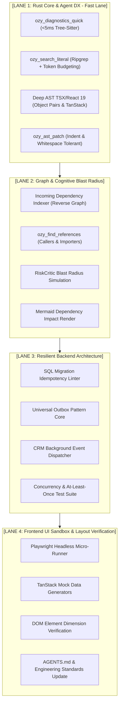

# Ozygram & Agent DX Evolution Roadmap (v1.5.0)

Este documento define el plan maestro de evolución técnica para **Ozygram** y la suite de herramientas para agentes de IA (**Agent DX**), incorporando búsqueda literal con presupuesto de tokens, diagnóstico de sintaxis instantáneo en memoria, soporte profundo para TSX/React 19 en AST, análisis de radio de impacto (Blast Radius), estandarización de migraciones SQL idempotentes y el patrón Transactional Outbox.

---

## 1. Visión y Objetivos Arquitectónicos

---

## 2. Matriz de Fases y Tareas Auditables (4 Fases x 4 Tareas)

### [FASE 1: Rust Core & Agent DX (Búsqueda Literal, AST y Diagnóstico)]
*Objetivo: Eliminar la fricción de herramientas nativas lentas, solucionar el manejo de rutas en Windows, controlar el presupuesto de tokens y brindar soporte a estructuras complejas de React/TSX.*

- [x] **Task 1.1: Exposición de `ozy_diagnostics_quick` en MCP**
  - **Componentes afectados**: `crates/ozymem-parser`, `crates/ozymem-server` (`src/symbols.rs`, `src/dispatch.rs`, `src/schemas.rs`).
  - **Descripción**: Conectar la función nativa `extract_ast_diagnostics` existente en `ozymem-parser` como una herramienta MCP pública. Permite validar errores sintácticos de Python, TypeScript, TSX, JavaScript, Rust y Go en memoria en menos de 5 ms sin levantar procesos externos.
  - **Criterio de Aceptación**: `cargo test -p ozymem-server` valida que llamadas a `ozy_diagnostics_quick` sobre código con errores retornen lista de `AstDiagnostic` con número de línea y mensaje descriptivo. [STATUS: COMPLETED]

- [x] **Task 1.2: Implementación de `ozy_search_literal` con Token Budgeting**
  - **Componentes afectados**: `crates/ozymem-core`, `crates/ozymem-server`.
  - **Descripción**: Crear un motor de búsqueda literal/regex en Rust sobre el workspace usando `regex` y `walkdir`. Normalizar rutas con separadores estándar de Windows/Linux. Incorporar parámetro `token_budget` (default: 800) y `max_results` para compactar la salida en snippets (`{ file, line, snippet }`) evitando volcados excesivos al contexto del LLM.
  - **Criterio de Aceptación**: Búsqueda en archivos grandes (> 2,000 líneas) retorna resultados en < 15 ms respetando el límite estricto de tokens y sin errores por contrabarras en Windows. [STATUS: COMPLETED]

- [x] **Task 1.3: Soporte para estructuras complejas de TSX y React 19 en Tree-Sitter**
  - **Componentes afectados**: `crates/ozymem-parser/src/lib.rs`.
  - **Descripción**: Extender las queries de Tree-Sitter para TypeScript/TSX capturando pares clave-valor de objetos literales con funciones (`pair key: ... value: [(arrow_function) (function_expression)]`) y funciones de celda en TanStack Table (`columns: [ { cell: ({ row }) => ... } ]`). Asignar nombres jerárquicos estructurados (ej. `columns[accessorKey].cell`).
  - **Criterio de Aceptación**: `ozy_get_symbol` y `ozy_parse` sobre archivos como `ingenieria-columns.tsx` extraen exitosamente las subfunciones de celda sin fallar. [STATUS: COMPLETED]

- [x] **Task 1.4: Reemplazo estructural con tolerancia de whitespace e indentación (`ozy_ast_patch`)**
  - **Componentes afectados**: `crates/ozymem-core/src/graph_backend/queries.rs`.
  - **Descripción**: Mejorar la lógica de `replace_symbol` para calcular automáticamente la indentación base del bloque de código original y reajustar los niveles de espaciado o tabulación del código propuesto. Manejar de forma transparente discrepancias entre saltos de línea CRLF y LF.
  - **Criterio de Aceptación**: Reemplazo de un método con indentación inconsistente se inyecta con la alineación exacta del archivo destino y pasa la verificación pre-vuelo de AST. [STATUS: COMPLETED]

---

### [FASE 2: Grafo de Dependencias e Impacto (Blast Radius Analysis)]
*Objetivo: Dotar al agente de capacidad predictiva para conocer qué archivos o símbolos se verán afectados antes de realizar una refactorización.*

- [x] **Task 2.1: Indexación de Grafo Inverso de Dependencias (`INCOMING_DEPENDENCY`)**
  - **Componentes afectados**: `crates/ozymem-parser/src/dependency_resolution.rs`, `crates/ozymem-core/src/graph_backend`, `crates/ozymem-server`.
  - **Descripción**: Añadir a `GraphBackend` y al grafo `petgraph` la capacidad de consultar dependencias entrantes (`who imports this file?`). Indexar imports y exports bidireccionalmente durante el escaneo del workspace.
  - **Criterio de Aceptación**: Consulta a un módulo base (ej. `database.py` o `types.ts`) lista con precisión todos los archivos dependientes en el workspace. [STATUS: COMPLETED]

- [x] **Task 2.2: Herramienta MCP `ozy_find_references`**
  - **Componentes afectados**: `crates/ozymem-core`, `crates/ozymem-server` (`src/symbols.rs`, `src/schemas.rs`, `src/dispatch.rs`).
  - **Descripción**: Exponer endpoint MCP que recibe `symbol_name` y `file_path` opcional, devolviendo todas las referencias, llamadas e importaciones del símbolo a lo largo del repositorio con snippet y número de línea.
  - **Criterio de Aceptación**: Pruebas unitarias confirman la resolución de referencias cruzadas entre archivos de Python y TypeScript. [STATUS: COMPLETED]

- [x] **Task 2.3: Integración de Blast Radius en `RiskCriticAgent` y `simulate_action`**
  - **Componentes afectados**: `python/ozy-brain/ozy_brain/risk.py`, `python/ozy-brain/ozy_brain/brain.py`.
  - **Descripción**: Enlazar el cálculo de referencias con el motor de evaluación de riesgos. Si una modificación proyectada toca una función importada por más de 5 módulos críticos, emitir advertencia obligatoria `[ALERT: HIGH_BLAST_RADIUS: SNAPSHOT REQUIRED]`.
  - **Criterio de Aceptación**: `pytest tests/test_risk.py` verifica la detección de alto radio de impacto y la recomendación de punto de restauración.

- [x] **Task 2.4: Renderizado de Diagramas de Impacto en Mermaid Textual**
  - **Componentes afectados**: `crates/ozymem-server/src/graph.rs`.
  - **Descripción**: Generar diagramas Mermaid de impacto con etiquetas textuales conformes al estándar Zero-Emoji (`[CALLS]`, `[IMPACTED]`, `[STATUS: ACTIVE]`) mostrando el subgrafo de dependencias hasta 2 saltos.
  - **Criterio de Aceptación**: Salida formateada en Markdown renderizable en clientes compatibles sin caracteres especiales ni emojis.

---

### [FASE 3: Resiliencia de Backend (Migraciones SQL y Outbox Pattern Reutilizable)]
*Objetivo: Estandarizar la seguridad de base de datos y la gestión de eventos asíncronos para cualquier backend de microservicios o CRM.*

- [x] **Task 3.1: Linter AST de Migraciones SQL Idempotentes**
  - **Componentes afectados**: `crates/ozymem-server/src/doctor.rs`, `python/ozy-brain/ozy_brain/data_engine.py`.
  - **Descripción**: Crear analizador estático para sentencias SQL de migración que verifique la presencia de cláusulas idempotentes (`IF NOT EXISTS`, `IF EXISTS`) y bloquee sentencias destructivas (`DROP TABLE`, `TRUNCATE`) sin indicador explícito de override.
  - **Criterio de Aceptación**: Integración en `ozy_doctor(action="audit_migrations")` detecta scripts no idempotentes y emite advertencia `[ALERT: NON_IDEMPOTENT_SQL]`.

- [x] **Task 3.2: Generalización del Módulo Universal Outbox Pattern**
  - **Componentes afectados**: `python/ozy-brain/ozy_brain/outbox_consumer.py`.
  - **Descripción**: Extraer la arquitectura transaccional de `outbox_consumer.py` hacia un módulo genérico con tabla `outbox_events` (columnas: `id`, `event_type`, `aggregate_id`, `payload`, `status`, `retry_count`, `created_at`, `processed_at`), configurable para SQLite y PostgreSQL.
  - **Criterio de Aceptación**: Pruebas de inserción y drenaje en cola demuestran desacoplamiento total y reintentos con backoff exponencial.

- [ ] **Task 3.3: Implementación del Worker Outbox en `api-geofal-crm`**
  - **Componentes afectados**: `crmnew/api-geofal-crm/app/services/outbox.py`.
  - **Descripción**: Incorporar el consumidor de eventos en background para despacho asíncrono de correos, webhooks y notificaciones WebSocket, garantizando que el endpoint HTTP principal responda en menos de 50 ms.
  - **Criterio de Aceptación**: Pruebas de carga demuestran latencia de endpoint < 50 ms con despacho garantizado de eventos en segundo plano.

- [ ] **Task 3.4: Suite de Pruebas de Concurrencia e Idempotencia**
  - **Componentes afectados**: Tests de backend en Python.
  - **Descripción**: Diseñar suite de tests automatizados simulando fallos de red, reinicios de proceso y entregas duplicadas para certificar semántica *at-least-once* e idempotencia en receptores.
  - **Criterio de Aceptación**: Cobertura de pruebas superior al 85% con cero pérdida de eventos en simulación de interrupción abrupta.

---

### [FASE 4: Frontend UI Sandbox & Verificación Visual]
*Objetivo: Erradicar la iteración a ciegas en dimensiones de columnas, layouts y componentes complejos.*

- [ ] **Task 4.1: Micro-Runner Headless de Playwright Local**
  - **Componentes afectados**: Directorio de testing y scripts de automatización frontend.
  - **Descripción**: Implementar script ligero en Node.js para renderizar páginas o componentes de forma aislada en segundo plano (`headless: true`) y capturar snapshots o métricas del DOM en milisegundos.
  - **Criterio de Aceptación**: El script arranca, captura snapshot y finaliza en menos de 3 segundos reportando estado de salida 0.

- [ ] **Task 4.2: Fixtures Universales de Datos Mock para TanStack Table**
  - **Componentes afectados**: Suites de prueba frontend.
  - **Descripción**: Crear generadores de datos ficticios con longitudes de texto extremas (nombres muy largos, códigos vacíos, números grandes) para estresar los layouts de tabla y detectar desbordamientos o solapamientos.
  - **Criterio de Aceptación**: Generación determinista de fixtures para pruebas de estrés de columnas de datos.

- [ ] **Task 4.3: Utilidad de Verificación de Anchos y Layout para Agentes**
  - **Componentes afectados**: Herramientas de soporte para agentes.
  - **Descripción**: Proveer utilidad para inspeccionar las dimensiones calculadas (`getBoundingClientRect`) de celdas de encabezado y datos, permitiendo al agente verificar visualmente y cuantitativamente el ajuste *pixel-perfect* antes de comitear cambios de CSS.
  - **Criterio de Aceptación**: Retorna anchos en píxeles de cada columna renderizada sin requerir abrir el navegador manualmente.

- [ ] **Task 4.4: Actualización de Guías en `AGENTS.md` y Documentación de Arquitectura**
  - **Componentes afectados**: `AGENTS.md`, `docs/architecture.md`.
  - **Descripción**: Actualizar los manuales para agentes reflejando las nuevas herramientas MCP, directrices de búsqueda literal, protocolo de verificación visual y estándares de calidad.
  - **Criterio de Aceptación**: Documentación validada y conforme a los lineamientos de arquitectura y el estándar Zero-Emoji.

---

## 3. Protocolo de Ejecución y Validación

1. **Desarrollo Incremental**: Cada tarea debe implementarse de forma atómica con su correspondiente prueba unitaria antes de avanzar a la siguiente.
2. **Pre-flight Check**: Ejecutar `cargo test` para crates de Rust y `pytest` para componentes de Python.
3. **Control de Cambios**: Mostrar el preview de diff antes de modificar cualquier archivo estructural.
4. **Marcado de Progreso**: Actualizar este archivo `roadmap.md` marcando `- [x]` conforme se complete y valide cada tarea individual.
